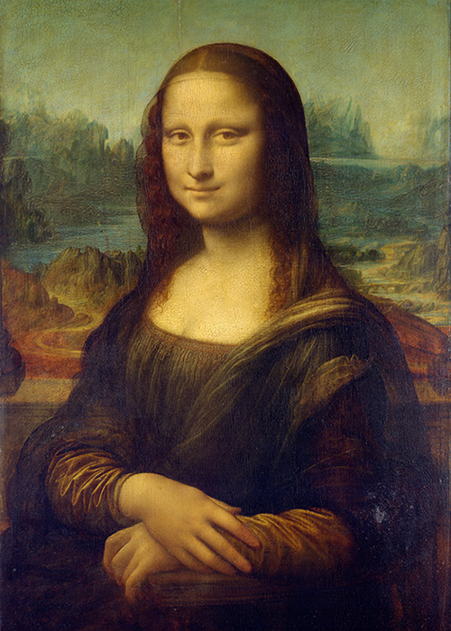

# ycao0043_9103_tut5

## Project Description
Hello

**Bold Text** or __Bold Text__
*Italic Text* or _Italic Text_

- Item 1
- Item 2
  - Subitem 2.1
  - Subitem 2.2

1. First Item
2. Second Item
3. Third Item

[Link Text](https://www.google.com)




```
function helloWorld() {
console.log("Hello, world!");
}
```

> This is a blockquote.