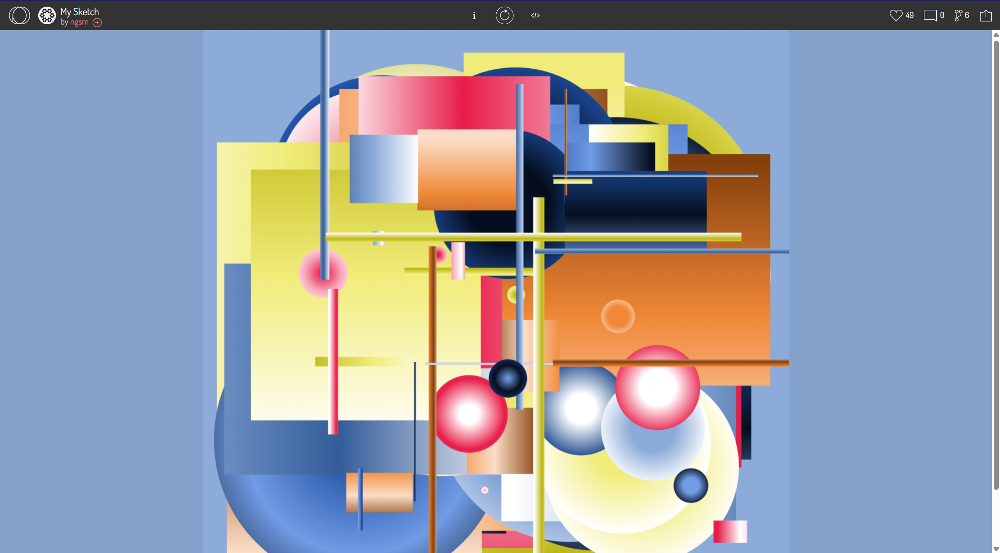
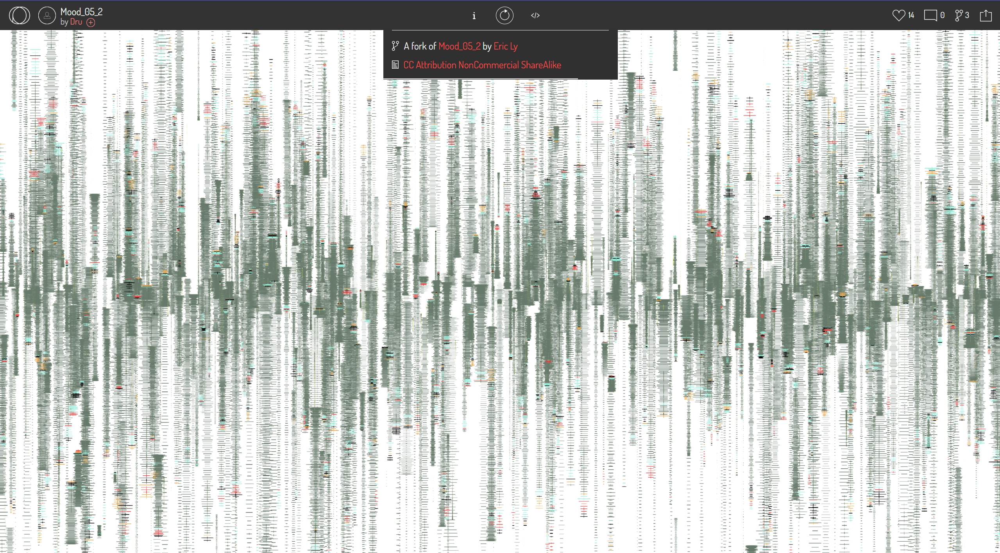

# Creative Coding Final Project - Individual Animation

## How to Interact with the Work

**Instructions:**
1. Load the page and the animation will start automatically
2. The animation runs continuously without user interaction required
3. The canvas is responsive - resize your browser window to see how the artwork adapts
4. All animations are time-based and will continue running indefinitely
5. No additional controls or interactions are needed - simply enjoy the dynamic visual experience

**Animation Details:**
- **Top Left Zone:** Shapes morph every frame with noise-based variations
- **Top Right Zone:** Lines animate with entrance effects over 180 frames (3 seconds at 60fps)
- **Bottom Left Zone:** Triangles refresh every 60 frames (1 second at 60fps)
- **Bottom Right Zone:** Arcs rotate continuously with noise-based speed variations
- **Transparency Effects:** Three zones have breathing-like transparency changes using Perlin noise

## Individual Animation Approach

I chose **Perlin noise** to create organic, smooth animations that evolve over time. This approach allows for complex, natural-looking movements that feel alive and dynamic.

## Animation Driver: Perlin Noise(Main) + Time

I selected **Perlin noise as the primary animation driver** with time-based progression. This choice allows me to:
- Create smooth, organic movements that feel natural
- Generate complex animations without requiring user input
- Create layered animations that work together harmoniously

## Animated Properties and Uniqueness

### 1. **Top Left Zone - Shape Morphing with Noise**
- **What's animated:** Rectangle sizes, positions, and circle radius variations
- **How it's unique:** Uses Perlin noise to create subtle, organic shape morphing that feels alive
- **Implementation:** Separate noise arrays for size, position X, and position Y create independent movement patterns

### 2. **Top Right Zone - Line Entrance Animations**
- **What's animated:** Lines with different entrance effects based on orientation
- **How it's unique:** Horizontal lines animate from left, vertical lines animate from top using translate and easing
- **Implementation:** Line grouping system that automatically detects line orientation and applies appropriate animations

### 3. **Top Right & Bottom Right Zones - Dynamic Transparency**
- **What's animated:** Alpha channel transparency of all shapes
- **How it's unique:** Uses custom makeRGBA function with noise-driven alpha changes
- **Implementation:** Each shape has independent transparency animation with different noise offsets

### 4. **Bottom Right Zone - Arc Rotation**
- **What's animated:** Arc rotation with easing and noise-based speed variation
- **How it's unique:** Combines rotation, easing functions, and Perlin noise for organic circular motion
- **Implementation:** Noise-based rotation speed that varies per arc, creating natural movement patterns

### 5. **Bottom Left Zone - Performance-Optimized Triangle Animation**
- **What's animated:** Triangle refresh frequency and position vibration
- **How it's unique:** Solved performance issues by implementing triangle caching and adding subtle vibration effects
- **Implementation:** Triangle data caching system with 60-frame refresh intervals and noise-based vibration

## Inspiration References

### 1. **Dynamic Transparency Breathing Effect**
- **Inspiration:** [OpenProcessing Sketch - My Sketch by ngsm](https://openprocessing.org/sketch/2384491)
- **Influence:** The color gradient effects in this project inspired me to implement dynamic transparency changes. I combined this concept with Perlin noise to create breathing-like transparency animations that give the artwork a living, organic feel.
- 

### 2. **Dynamic City Roads Concept**
- **Inspiration:** [OpenProcessing Sketch - Mood_05_2 by Dru ](https://openprocessing.org/sketch/2246206)
- **Influence:** The dynamic line transformations in this project inspired me to create animated city roads in the top-right zone. The horizontal and vertical lines represent dynamic roads, symbolizing the vibrant, concrete life of a city in motion.
- 


## Technical Explanation

### 1. **Perlin Noise Implementation**
```javascript
// Separate noise arrays for different properties
topLeftRectSizeNoise.push(noise(i * noiseStep));
topLeftRectPosNoiseX.push(noise(i * noiseStep + 10));
topLeftRectPosNoiseY.push(noise(i * noiseStep + 20));
```
**How it works:** Creates independent noise sequences for different animation properties, ensuring smooth, organic movement.

### 2. **Line Grouping and Orientation Detection**
```javascript
let isVertical = abs(l.x1 - l.x2) < 1;
let isHorizontal = abs(l.y1 - l.y2) < 1;
```
**How it works:** Automatically detects line orientation by comparing coordinates, then applies appropriate entrance animations.

### 3. **Custom RGBA Color Function**
```javascript
function makeRGBA(redInputValue, greenInputValue, blueInputValue, alphaInputValue) {
  return {
    r: redInputValue,
    g: greenInputValue,
    b: blueInputValue,
    a: alphaInputValue
  };
}
```
**How it works:** Creates color objects with separate RGB and alpha values, enabling dynamic transparency manipulation.

### 4. **Triangle Caching System**
```javascript
if (frameCount % triangleRefreshInterval === 0 || bottomLeftTriangles.length === 0) {
  // Regenerate triangles
}
```
**How it works:** Stores triangle data and only regenerates every 60 frames, dramatically improving performance while maintaining visual quality.

### 5. **Easing Function Implementation**
```javascript
function easeAnimation(t) {
  return t < 0.5 ? 4 * t * t * t : 1 - Math.pow(-2 * t + 2, 3) / 2;
}
```
**How it works:** Provides smooth acceleration and deceleration for animations, creating more natural movement.

## Major Changes to Group Code

### 1. **Performance Optimization for Bottom Left Triangles**
- **Problem:** Original code used `random()` every frame, causing excessive CPU usage and flickering
- **Solution:** Implemented triangle caching system with controlled refresh intervals
- **Impact:** Reduced CPU usage while maintaining visual quality

### 2. **Enhanced Animation System**
- **Added:** Perlin noise arrays for organic movement
- **Added:** Line grouping and orientation detection
- **Added:** Custom RGBA color system
- **Added:** Easing functions for smooth animations

### 3. **New Animation Properties**
- **Shape morphing** in top-left zone
- **Line entrance animations** in top-right zone
- **Dynamic transparency** across multiple zones
- **Arc rotation** in bottom-right zone
- **Triangle vibration** in bottom-left zone

## External Tools and Techniques

### **Microsoft Copilot AI Assistant**
- **Application:** I use Microsoft Copilot to help organize the lines group system for better horizontal and vertical line detection in the top-right zone.
- **The prompts is:** "I want to use the method of 'if the x1 and x2 coordinates are almost the same (the difference is less than 1), it means this is a vertical line' to distinguish the horizontal and vertical line animations in the three const groups. How can I modify the code without adjusting the const array?"
- **And the reply is:** Copilot suggested creating a combined array with spread operators and adding weight properties, then using coordinate comparison to detect line orientation and apply different entrance animations accordingly. 